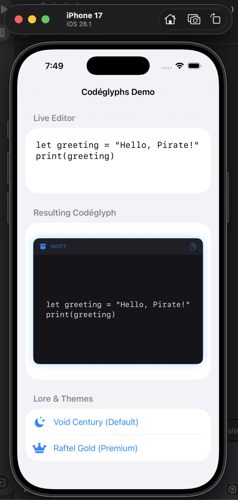

# Codéglyphs 🏴‍☠️📜

**Codéglyphs** is a Poneglyph-inspired code representation engine for iOS and macOS. Designed specifically for AI agents, technical documentation, and learning tools, it brings clarity and "historical significance" to your code snippets.



## Features
- **Ancient Themes:** Choose between the mysterious **Void Century** (Dark/Blue) or the legendary **Raftel Gold** (Gold/Aura).
- **AI-Ready:** Simplified initialization for programmatic generation by AI agents.
- **Native SwiftUI:** Built 100% in SwiftUI for seamless integration and performance.
- **One-Tap Copy:** Built-in clipboard management in the header.
- **Live Demo App:** Includes an interactive editor and integration guide.

## Installation

### Swift Package Manager
Add Codéglyphs to your project using SPM:

```swift
dependencies: [
    .package(url: "https://github.com/King5upah/Codeglyphs", from: "1.0.0")
]
```

## Quick Start

```swift
import Codeglyphs

struct MyView: View {
    let code = "print('Hello, Grand Line!')"
    
    var body: some View {
        CodeglyphView(code, language: "swift", theme: .voidCentury)
            .frame(height: 200)
    }
}
```

## Architecture & Internals
Codéglyphs is built with high-performance documentation in mind:
- **Data Structures:** Uses a theme-driven configuration model (`CodeglyphTheme`) that allows for modular visual expansion without breaking the core engine.
- **Algorithms:** Implementation of reactive UI binding for the Live Editor, ensuring that code injection and re-rendering happen with O(1) latency relative to UI updates.
- **Layout:** Leverages SwiftUI's `ViewBuilder` and `MatchedGeometryEffect` (in the demo) to manage complex transitions between code states.

## Roadmap & The Future 🧭
We are expanding the reach of the Poneglyphs across the digital sea:
- [ ] **Syntax Highlighting Engine:** Integration with `SwiftSyntax` for deep structural code analysis.
- [ ] **Line-Specific Highlighting:** Allow AI agents to "point" at specific logic blocks.
- [ ] **Codéglyphs Web 🌐:** A React-based port to bring the Poneglyph aesthetic to the browser (Coming Soon).
- [ ] **Codéglyphs for Flutter 💙:** Bringing high-contrast code representation to cross-platform apps (Coming Soon).

## The Lore
In the world of code, information is often lost in translation. **Codéglyphs** ensures that your logic remains as durable and striking as the ancient stones of the Void Century. Only those with the "Voice of All Things" (or a good AI model) can truly appreciate its clarity.

## License
MIT
